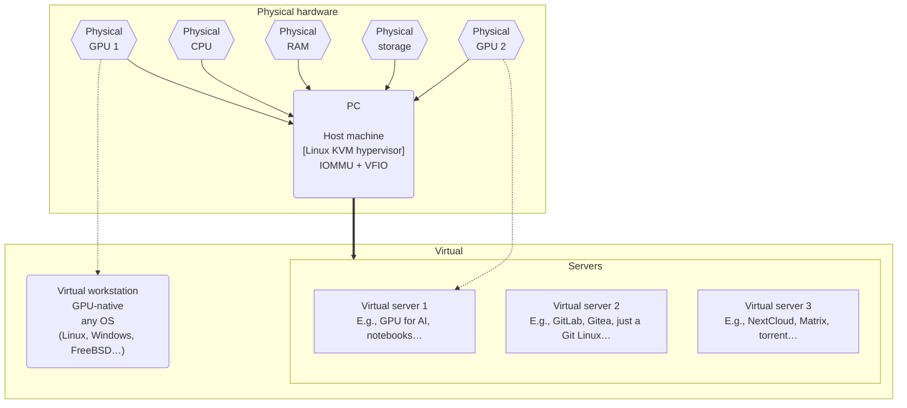

# GHost

> **GHost: G*raphical* Host**

## Overview


host ==> vws


### What does it do?

**GHost** is a type-2 hypervisor-workstation (*hyperstation?* 🫣) designed to seamlessly orchestrate multiple PCIe devices (GPU, TPU…), across ad hoc environments (Python, Windows, servers…), in both combined and discrete operations. It can power as many seats as you can fit GPUs (2 is a good maximum on most consumer platforms).

In plain English, it's an always-on single box that virtualizes whatever infrastructure you want to throw at it. This guide offers a number of working examples.  
This notably includes full-fledged "native" GPU-powered workstation VMs for graphical applications, with their own display, keyboard, mouse; or AI GPU/TPU servers.

Tested on Kubuntu 24.04 🡪 *should* thus work on most recent Debian-based distros.

> [!Tip]
> There's a headless/CLI variant called **SHost: S*erver* Host**.[^SHost]


### Hardware requirements

1. Exactly **1 PC** (x64) whose motherboard:
   - supports **IOMMU** virtualization features,
   - has *enough™* **PCIe ≥ 4.0 lanes** (usually **20** on consumer platforms),
   - and *enough™* **RAM** & CPU **cores** (I like **≥ 48 GB** over **≥ 12** physical cores)
2. At least **2 GPU** (counting iGPU, if any)
3. *Enough™* NVMe storage (say 50GB per OS + userland + pro use case like data, models, content, audio/video, samples...), ideally two physical drives or more (one for the host; others for VMs).

**Recommended** for convenience, notably during setup:

- Any solution to display 2 machines concurrently (2 physical displays, some picture-by-picture feature…).
- 2 keyboard-mouse combos. Alternatively, a KVM switch (hardware device), or a Synergy[^synergy] license (software utility, ideal if you have multiple displays).
- A second computer to SSH into the host.


### About this guide

This procedure gets you there *as fast as possible*.

> ***"Premature optimization is the root of all evil."***
>
> — Donald Knuth

- **Great defaults**  
   Need variations? 🡪 See [Resources](#resources) for links to docs, repos, guides, discussions…
- **Terse** (no discussion)
- Formatting:
   - Bold **keywords**
   - *You can **skip** all sentences in **italics**!*
- **Atomic** steps (do **ONE thing**)
- **Direct links** (marked with 🔽)

<!--
To make sense of these instructions, and dig deeper, see [`disc.md`](disc.md) — it's my little book about this kind of virtualized infra, and probably contains answers you seek.
-->

> [!Note]
> #### Hardware used
>
> - Chipset: AMD AM5 X670E (req. PCIe ≥ 4.0)
> - DDR5: 64 GB
> - CPU: AMD Ryzen 7950X (16/32 cores)
> - GPU 0: AMD Raphael (integrated, shared memory)
> - GPU 1: Nvidia RTX 3090 (24 GB)
> - NVMe 0: host OS (2 TB)
> - NVMe 1-3: ZFS datasets for VMs & data (12 TB)


## Setup

> [!Tip]
> Footnote = **Help!**
> 🡪 *If some* `thing`[^footnote] *doesn't work, check out its footnote!*

### Linux

*Two approaches for the host GUI: 'richer' (KDE, Gnome...) or 'leaner' (Mate, i3...).  
Here we go with KDE on Ubuntu, because it has many required features out of the box.*

#### Make a bootable device

1. Download the **Kubuntu [`.iso 🔽`](https://cdimage.ubuntu.com/kubuntu/releases/24.04/release/kubuntu-24.04-desktop-amd64.iso)** file.

1. Download the latest **Balena Etcher [release](https://github.com/balena-io/etcher/releases)** for your *current* OS (where you will flash the `.iso` to USB).

1. Install Etcher.

   ```bash
   sudo apt install ./balena-etcher_******_amd64.deb
   ```

1. Launch it (GUI 🖱️ app in your usual menu).

1. Flash `kubuntu-24.04-desktop-amd64.iso` onto your USB stick.

1. Shutdown the PC.

#### Install OS

1. ⚠️ **Unplug (physically) all video outputs, except the host's.**

   *In this guide, the AMD iGPU is dedicated to the host.  
   So at this point, we remove all video cables going out of the Nvidia GPU.*[^2]

1. Boot to USB to setup Kubuntu. Two requirements:

   1. **Btrfs** on the OS root partition ("`/`") for some neat features.[^btrfs-root]  
      *NOTE: **NEVER** use **RAID 5** or **6** with Btrfs, it's **fatally flawed**.*  
      *All manners of RAID 1 and 0 (1c3, 1c4, 10) are perfectly fine however.*
      
   1. Agree to install **`virt-manager`** to get the KVM/QEMU stack properly installed.
   
1. Remove the USB stick when asked to, then press <kbd>Enter</kbd>.

   You'll reboot on the freshly installed system, to be greeted by the KDE welcome wizard.

#### Post-install

1. Upgrade packages.

   ```bash
   sudo apt update
   sudo apt upgrade
   ```

1. \[Optional\] Play with OS & DE settings to your liking.

1. **(Recommended)** Setup additional devices meant to be used by the host, such as fast storage for VMs and AI models.


1. \[Optional\] Install your browser of choice (I use [Brave](https://brave.com/linux/#debian-ubuntu-mint)).

   ```bash
   sudo apt install curl

   sudo curl -fsSLo /usr/share/keyrings/brave-browser-archive-keyring.gpg https://brave-browser-apt-release.s3.brave.com/brave-browser-archive-keyring.gpg

   echo "deb [signed-by=/usr/share/keyrings/brave-browser-archive-keyring.gpg] https://brave-browser-apt-release.s3.brave.com/ stable main"|sudo tee /etc/apt/sources.list.d/brave-browser-release.list

   sudo apt update

   sudo apt install brave-browser
   ```

### Security (1)

#### Secrets

You should probably have some solution to manage secrets, such as a password management system of sorts.

#### SSH server

OpenSSH 

### Terminal (1)

### IOMMU

From this point on, we mostly rely on Bryan Steiner's excellent [tutorial](https://github.com/bryansteiner/gpu-passthrough-tutorial/).

### Libvirt hooks

### VM (1) creation

### Performance tweaks


## Resources

A-Z titles link to official project page.


### [Kubuntu](https://kubuntu.org/)

### [Etcher](https://etcher.io/)

### [Btrfs](https://docs.kernel.org/filesystems/btrfs.html)

[Documentation](https://btrfs.readthedocs.io/en/latest/)

- [`mkfs.btrfs(8)`](https://btrfs.readthedocs.io/en/latest/mkfs.btrfs.html)
- [Volume management](https://btrfs.readthedocs.io/en/latest/Volume-management.html)
- [Subvolumes](https://btrfs.readthedocs.io/en/latest/Subvolumes.html)

Options

- disable COW: [`chattr +C`](https://wiki.archlinux.org/title/Btrfs#Disabling_CoW)
- [`block-group-tree`](https://btrfs.readthedocs.io/en/latest/mkfs.btrfs.html#filesystem-features)


### `chattr`

https://man7.org/linux/man-pages/man1/chattr.1.html

https://man7.org/linux/man-pages/man1/lsattr.1.html


### [XFS](https://xfs.wiki.kernel.org/)


### [Synergy](https://symless.com/synergy)

### [Rsync](https://rsync.samba.org/)

- [Repository](https://github.com/RsyncProject/rsync)
- [Tutorial](https://www.digitalocean.com/community/tutorials/how-to-use-rsync-to-sync-local-and-remote-directories)


----

work-in-progress \[2024.09.01\]

[^footnote]: Click the ending link to go back up where you were:

[^synergy]: Control multiple machines (Linux, Mac, Windows) with one keyboard+mouse combo, as if they were multiple displays connected to the same PC.  
  License cost per user (pay once, keep forever): \$29 for up to 3 machines, or \$49 for 15.

[^SHost]: `SHost` (Server Host) is the **CLI/headless** variant.
     - It's closer to a Type-I hypervisor.
     - Both `GHost` & `SHost` allow for 'native' graphical guests with plugged-in display, keyboard, mouse…
     - Both are part of my tentative [***Ultra***structure]() computing paradigm.


[^2]: Generally, unplug all non-host devices during host OS installation. This ensures that, later on:
      - proper *graphics* drivers will get installed on the host;
      - auto-configs (Xorg…) work well;
      - guest GPU is available for passthrough. *In this guide, it's the Nvidia dGPU.*


[^?]: Consider using PCIe splitters if you don't have enough slots. Keep in mind that expensive PLX chips won't help for concurrent use, so I'd avoid them for GHost.


[^btrfs-root]: Easy system rollback/versioning, remote backup, later conversion of a single device to RAID 1, and more.

[^raid0]: Using **RAID 0 is highly discouraged** unless you do extremely regular backups, or you just plain don't care about your data.

[^xfs]: 


