# GHost

> **GHost: the G*raphical* Host.**  
Whole infrastructure in 1 PC.

Three guides are planned, plus an automated script.

1. (This file) **Basic guide**. Terse, instructions-only, fastest path.

2. **Advanced guide**. Much longer, more involved.

3. **A discussion**. Explains most of what was left out of procedural guides.

4. The automated script needs human intervention (to change UEFI settings, select storage, etc.)


## Overview

### What does it do?

Functionally, it lets you deploy multiple workstations and servers in a single PC. It's a SOHO-in-a-box, an all-in-one micro information system, your tiny enterprise infrastructure, your personal home-based 'cloud'. Atop which, as expected with a PC, sits your collection of glorious desktop workstations, complete with 'native' GPU for intensive graphics, hi-res display, hi-fps gaming, AI, compute…

> [!Note]
> Although fairly involved to setup, **it really is a one-off**. My first such setup in 2017 on dual Xeons lasted well into the 2020s, until I voluntarily shifted to this much denser Ryzen platform. And you might learn a little about a lot of things in going through the journey.  
>
> The end result is **easy to maintain** (including migration to any new hardware or OS version). If you're like me, it'll likely be much more **convenient to use** than any regular workstation, as you live in the 'meta-OS' space of core infrastructure where you feel more like a realm admin than a basic user on a lone machine. The feature set is nearly limitless, provided you buy the hardware to accommodate it.

The following visual spec gives an example idea of what sxervices could be deployed in the GHost infrastructure.

```mermaid
graph TB

   subgraph p["1 Physical Machine (x86-64 PC)"]
      direction TB

      pnet["Ethernet<br>2× NIC"] --> h
      pstor["Storage<br>Btrfs (OS)<br>XFS (VM, data)"] --> h
      pmem["Memory<br>64 GB"] --> h
      pcpu["CPU<br>16 cores"] --> h
      pgpu1["GPU<br>Ryzen iGPU"] --> h
      pgpu2["GPU<br>Nvidia PCIe"] --> h
      pusb["USB<br>2× controllers"] --> h
      h{{"fa:fa-linux<br>Linux<br>kernel<br><br>"}}

      h ==> v

      subgraph v["KVM Hypervisor"]
         direction LR

         subgraph s["Backend services"]
            direction LR

            vsrv["Virtual Machines<br><br>GPU+CUDA<br>GitLab<br>NextCloud<br>Matrix server<br>pfSense<br>…"]
            cont["CONTAINERS<br><br>(Docker, LXC…)<br>Python envs<br>AI inference<br>Media server<br>PiHole<br>…"]
         end

         subgraph g["Frontend GUI Clients (concurrency is GPU-bound)"]
            direction TB

            gw("WORKSTATION<br>(main)<br><br>PCIe GPU passthrough<br>with display,<br>keyboard, USB, NIC…")
            gn("(n)<br>WORKSTATIONS<br><br>clone,snapshot,<br>ad hoc env…")
            gg("ENTERTAINMENT<br>SYSTEM<br><br>Gaming GPU,<br>VR, Hi-Fi, <br>home cinema,<br>streaming<br>…")
         end

         s --> g
      end
   end

subgraph n["Network interfaces"]
   net("Routing<br>Reverse proxy<br>Firewall<br>")
   pn("Public internet<br><br>self-hosted<br>services")
   sn("Secure networks<br><br>LAN, VLAN,<br>VPNs, SSH…")
   net --> pn & sn
end

p --- net

pn --- o(("other people<br><br>family, friends, comm.,<br>collab, clients<br>…"))
sn -.- o
sn --"Remote"--- you

uip("Peripherals<br><br>(Display,<br>keyboard, mouse,<br>sound, gamepad…)")
p === uip =="Local"==== you(("You<br>(user/seat)<br>😎"))



p:::main
v:::wht
h:::lit
pgpu1:::tr1
pmem:::tr1
pcpu:::tr1
pstor:::tr1
pnet:::tr1
pusb:::tr1
pgpu2:::tr1
s:::blu
g:::grn
gw:::main
gn:::main
gg:::main
vsrv:::tr2
cont:::tr2
uip:::tr1
net:::tr1
n:::main
sn:::cyan
pn:::red
o:::grn
you:::grn
classDef main fill:#0d1117,stroke:#30363c
classDef tr1 fill:#0d1117,stroke:#0d1117
classDef tr2 fill:#000,stroke:#000
classDef wht fill:#000,stroke:#f0f6fc
classDef cyan fill:#000,stroke:#0ff
classDef blu fill:#000,stroke:#007FFF
classDef lit fill:#eee,stroke:#333,color:#333
classDef grn fill:#000,stroke:#0f0
classDef red fill:#000,stroke:#f00
```



Formally:
- type-2 hypervisor
- designed to seamlessly orchestrate multiple PCIe devices (GPU, TPU…)
- across ad hoc environments (Python, Windows, servers…)
- in both combined and discrete operations (hardware permitting)


In plain English, it's an always-on single-box machine, that virtualizes any hardware you want to throw at it, whether as 'headless' servers or rich GUI workstations (with their own display, keyboard, mouse). This guide offers a number of working examples.  
This notably includes full-fledged "native" GPU-powered workstation VMs for graphical applications, ; or AI GPU/TPU servers.

It can power as many seats as you can fit GPUs (2 is a good maximum on most consumer platforms), but is mostly designed for a single user.

Tested on Kubuntu 24.04 🡪 *should* thus work on most recent Debian-based distros.
<!--
> [!Tip]
> There's a headless/CLI variant called **SHost: S*erver* Host**.[^SHost]
-->

### Hardware requirements

1. Exactly **1 PC** (x64) whose motherboard:
   - supports **IOMMU** virtualization features,
   - has *enough™* **PCIe ≥ 4.0 lanes** (usually **20** on consumer platforms),
   - and *enough™* **RAM** & CPU **cores** (I like **≥ 48 GB** over **≥ 12** physical cores)
2. At least **2 GPU** (counting iGPU, if any)
3. *Enough™* NVMe storage (say 50GB per OS + userland + pro use case like data, models, content, audio/video, samples...), ideally two physical drives or more (one for the host; others for VMs).

**Recommended** for convenience, notably during setup:

- Any solution to display 2 machines concurrently (2 physical displays, some picture-by-picture feature…).
- 2 keyboard-mouse combos. Alternatively, a KVM switch (hardware device), or a Synergy[^synergy] license (software utility, ideal if you have multiple displays).
- A second computer to SSH into the host.


### About this basic guide

This procedure gets you there *as fast as possible*.

> ***"Premature optimization is the root of all evil."***
>
> — Donald Knuth

- **Great defaults** (battle-hardened)  
   *Need variations?* 🡪 *See [Resources](#resources) for docs, guides, discussions, repos…*
- **Terse** (no talk)
- **Glance**-friendly formatting:
   - Bold **keywords**
   - *You can **skip** all sentences in **italics**!*
- **Atomic** steps: do **ONE thing** (easy to do it well; hard to miss)
- **Direct links** (marked with 🔽)

<!--
To make sense of these instructions, and dig deeper, see [`disc.md`](disc.md) — it's my little book about this kind of virtualized infra, and probably contains answers you seek.
-->

> [!Note]
> #### Hardware used
>
> - Chipset: AMD AM5 X670E (req. PCIe ≥ 4.0)
> - DDR5: 64 GB
> - CPU: AMD Ryzen 7950X (16/32 cores)
> - GPU 0: AMD Raphael (integrated, shared memory)
> - GPU 1: Nvidia RTX 3090 (24 GB)
> - NVMe 0: host OS (2 TB)
> - NVMe 1-3: ZFS datasets for VMs & data (3× 4TB)


## Setup

> [!Tip]
> Footnote = **Help!**
> 🡪 *If some* `thing`[^footnote] *doesn't work, check out its footnote!*

### Host OS

> [!Note]
> In GHost, the Host is 

*Two approaches for the host GUI: 'richer' (KDE, Gnome...) or 'leaner' (Mate, i3...).  
Here we go with KDE on Ubuntu, because it has many required features out of the box.*

> [!Note]
> This host OS, though perfectly usable as a workstation, will eventually operate as the lowest layer (the "hypervisor") in our single-PC virtualized infrastructure. It will sit 'underneath it all' from the standpoint of our ultimate virtual workstation. We give it GUI capabilities because it's cheap (integrated in most consumer CPUs), convenient for setup and use (as you're experiencing right now), and actually harder to avoid than not on consumer platform, whose default specs are optimized for workstation/desktop use as opposed to server (no dumb VGA or serial outputs, or adapters & devices to leverage those).  
> If you use a Epyc, Thunderbolt, or Xeon platform, YMMV; consider doing the hypervisor as a pure 'headless' server.


#### Make a bootable device

1. Download the **Kubuntu [`.iso 🔽`](https://cdimage.ubuntu.com/kubuntu/releases/24.04/release/kubuntu-24.04-desktop-amd64.iso)** file.

1. Download the latest **Balena Etcher [release](https://github.com/balena-io/etcher/releases)** for your *current* OS (where you will flash the `.iso` to USB).

1. Install Etcher.

   ```bash
   sudo apt install ./balena-etcher_******_amd64.deb
   ```

1. Launch it (GUI 🖱️ app in your usual menu).

1. Flash `kubuntu-24.04-desktop-amd64.iso` onto your USB stick.

1. Shutdown the PC.

#### Install Linux

1. ⚠️ **Unplug (physically) all video outputs, except the host's.**

   *In this guide, the Ryzen iGPU is dedicated to the host.  
   So we unplug all video cables going out of the Nvidia GPU.*[^unplug]

1. Boot to USB to setup Kubuntu.

1. Follow the steps (language, time, keyboard layout, network…) until it asks you about storage.  

1. Choose **Btrfs** on the OS root partition ("`/`") for some neat features.[^btrfs-root]
      
      NOTE: ⛔ **NEVER** use **RAID 5** or **6** with Btrfs, it's **fatally flawed**.  
      All manners of RAID 1 and 0 (1c3, 1c4, 10) are perfectly fine however.
      
1. Agree to install **`virt-manager`** to get the KVM/QEMU stack properly installed.
   
1. Remove the USB stick when asked to, then press <kbd>Enter</kbd>.

   You'll reboot on the freshly installed system, to be greeted by the KDE welcome wizard.

#### First boot

1. Upgrade packages.

   ```bash
   sudo apt update
   sudo apt upgrade
   ```


#### Shell

1. Install your preferred CLI shell.[^shell]

   *See* **[`Shell`](doc/shell.md)** *for more details.*

1. *(Optional) Play with OS & DE settings to your liking.  
Custom DNS, packages like `htop`, theme, etc.*

#### Additional storage

1. **Recommended**: Setup additional devices meant to be used by the host, such as **high-IOPS storage** for VMs, and large fast storage for large static file collections like AI models.

   *It's hard to generalize for all users.*  
    *See* 📜 **[Storage](doc/storage.md)** *if needed.*

   *Example: array of n=`3` drives; in RAID level `0`; XFS filesystem.*

   ```bash
   sudo apt install mdadm                    # Multiple Devices ADMinistration
   sudo mdadm -Cv /dev/md0 -l0 -n3 $disk{1,2,3}          # Create RAID level 0

   cat /proc/mdstat                                          # Check the array
   sudo mdadm --detail -vv /dev/md03

   sudo mkfs.xfs -L mass /dev/md0                              # Format to XFS

   sudo mount -mo noatime,logbsize=256k /dev/md0 /mnt/mass          # Mount it
   ```

   *To setup boot mount, get the UUID…*

   ```bash
   sudo blkid | grep md0
   sudo nano /etc/fstab
   ```

   *… and add it to `fstab`.*

   ```
   UUID=<your-uuid> /mnt/mass xfs defaults,noatime,logbsize=256k 0 0
   ```
   

#### Browser

1. *(Optional) Install your browser of choice (I use [Brave](https://brave.com/linux/#debian-ubuntu-mint)).*  
  *Instructions as of Sept. 2024:*

   ```bash
   sudo apt install curl

   sudo curl -fsSLo /usr/share/keyrings/brave-browser-archive-keyring.gpg https://brave-browser-apt-release.s3.brave.com/brave-browser-archive-keyring.gpg

   echo "deb [signed-by=/usr/share/keyrings/brave-browser-archive-keyring.gpg] https://brave-browser-apt-release.s3.brave.com/ stable main"|sudo tee /etc/apt/sources.list.d/brave-browser-release.list

   sudo apt update
   sudo apt install brave-browser
   ```


### Security (1)

#### Secrets

1. Setup whatever means you use to **store and access secrets**.  
   *Software, pen and paper, savant memory… it's up to you.*[^secrets]

1. Fill in all **credentials for this workstation**. User password, any filesystem encryption passphrase, browser sync, etc.


#### Firewall

**`ufw`**, the **U**ncomplicated **F**ire**w**all,[^ufw] is preinstalled with Ubuntu.

GUI setup:

1. Open the Settings > **Firewall** app  

1. Tick the top box to **enable** it.

1. Check that "Default **Incoming** Policy" is set to **`Ignore`**.

1. Check that "Default **Outgoing** Policy" is set to **`Allow`**.

[CLI setup](https://documentation.ubuntu.com/server/how-to/security/firewalls/):

```bash
sudo ufw enable
sudo ufw status verbose
```


#### SSH server

1. Install OpenSSH.

   ```bash
   sudo apt install sshd
   ```

1. 


### IOMMU

From this point on, we mostly rely on Bryan Steiner's excellent [tutorial](https://github.com/bryansteiner/gpu-passthrough-tutorial/).

### Libvirt hooks

### VM (1) creation

### Performance tweaks


## Resources

A-Z titles link to official project page.


### [Kubuntu](https://kubuntu.org/)

### [Etcher](https://etcher.io/)

### [Btrfs](https://docs.kernel.org/filesystems/btrfs.html)

[Documentation](https://btrfs.readthedocs.io/en/latest/)

- [`mkfs.btrfs(8)`](https://btrfs.readthedocs.io/en/latest/mkfs.btrfs.html)
- [Volume management](https://btrfs.readthedocs.io/en/latest/Volume-management.html)
- [Subvolumes](https://btrfs.readthedocs.io/en/latest/Subvolumes.html)

Options

- disable COW: [`chattr +C`](https://wiki.archlinux.org/title/Btrfs#Disabling_CoW)
- [`block-group-tree`](https://btrfs.readthedocs.io/en/latest/mkfs.btrfs.html#filesystem-features)


### `chattr`

https://man7.org/linux/man-pages/man1/chattr.1.html

https://man7.org/linux/man-pages/man1/lsattr.1.html


### [XFS](https://xfs.wiki.kernel.org/)


### [Synergy](https://symless.com/synergy)

### [Rsync](https://rsync.samba.org/)

- [Repository](https://github.com/RsyncProject/rsync)
- [Tutorial](https://www.digitalocean.com/community/tutorials/how-to-use-rsync-to-sync-local-and-remote-directories)


----

work-in-progress \[2024.09.01\]

[^synergy]: Control multiple machines (Linux, Mac, Windows) with one keyboard+mouse combo, as if they were multiple displays connected to the same PC.  
  License cost per user (pay once, keep forever): \$29 for up to 3 machines, or \$49 for 15.

[^footnote]: Click the ending link to go back up where you were:

[^unplug]: Generally, unplug all non-host devices during host OS installation. This ensures that, later on:  
      - proper graphics drivers will get installed on the host (*AMD in this guide*);  
      - auto-configs (Xorg…) work well;  
      - guest GPU is available for passthrough. *In this guide, it's the Nvidia dGPU.*  

[^btrfs-root]: Easy system rollback/versioning, remote backup, later conversion of a single device to RAID 1, and more.

[^secrets]: This guide doesn't have general opinions about which solution best fits **you**, as security depends on threat profile; but most people should use **something** fitting their personal needs. Here are a few suggestions I'm using concurrently for different purposes.
      - [Proton Pass](https://proton.me/pass) as part of a [secure suite of services](https://proton.me/) including email with domain, VPN, cloud storage, doc writing, password management; and combined features such as uniquely generated email addresses per account. *Note that Proton services lack many Linux clients (Drive, Pass…), forcing you to the web interface. They notably has little to no CLI tools. That's too bad, but it's not like there are many alternatives at that level of security and privacy.*
      - [1Password](https://1password.com/) for a standalone, comprehensive secrets solution. It has extensive comfort features to store all manners of secrets, including ssh keys, payment credentials, social security and ID scans, etc.  
      - [`pass`](https://www.passwordstore.org/) (CLI tool), and [compatible](https://www.passwordstore.org/#other) apps.  
      
      Both Proton and 1Password are good for org and family admins: pass sharing, account management & retrieval…  
      You know who you are if you want/need `pass` (I consider it a better but harder solution for most purposes).

[^ufw]: 📘`man`: [`ufw(8)`][man-ufw]

[^shell]: Ricing: I use [Zsh](https://zsh.org/),  
with [Oh My Zsh](https://ohmyz.sh/) (OMZ),  
the [Spaceship Prompt](https://spaceship-prompt.sh/) theme,  
and a [NerdFont](https://github.com/ryanoasis/nerd-fonts) (preview them [here](https://www.nerdfonts.com/font-downloads)).  

  Whenever you install a new terminal tool on a machine, check for its [OMZ plugin](https://github.com/ohmyzsh/ohmyzsh/wiki/Plugins).  
E.g., 
[`sudo`](https://github.com/ohmyzsh/ohmyzsh/tree/master/plugins/sudo), 
[`git`](https://github.com/ohmyzsh/ohmyzsh/tree/master/plugins/git), 
[`1password`](https://github.com/ohmyzsh/ohmyzsh/tree/master/plugins/1password), 
[`pip`](https://github.com/ohmyzsh/ohmyzsh/tree/master/plugins/pip), 
[`ssh`](https://github.com/ohmyzsh/ohmyzsh/tree/master/plugins/ssh), 
[`ssh-agent`](https://github.com/ohmyzsh/ohmyzsh/tree/master/plugins/ssh-agent), 
[`systemd`](https://github.com/ohmyzsh/ohmyzsh/tree/master/plugins/systemd) 
[`ufw`](https://github.com/ohmyzsh/ohmyzsh/tree/master/plugins/ufw), 
[`ubuntu`](https://github.com/ohmyzsh/ohmyzsh/tree/master/plugins/ubuntu), 
[`vscode`](https://github.com/ohmyzsh/ohmyzsh/tree/master/plugins/vscode)…  
Don't add too many (strict need-to basis), as it may slow down shell startup.


[^SHost]: `SHost` (Server Host) is the **CLI/headless** variant.  
     - It's closer to a Type-I hypervisor.  
     - Both `GHost` & `SHost` allow for 'native' graphical guests with plugged-in display, keyboard, mouse…  
     - Both are part of my tentative [***Ultra***structure]() computing paradigm.  

[^?]: Consider using PCIe splitters if you don't have enough slots. Keep in mind that expensive PLX chips won't help for concurrent use, so I'd avoid them for GHost.


[^raid0]: Using **RAID 0 is highly discouraged** unless you do extremely regular backups, or you just plain don't care about your data.

[^xfs]: 


[man-ufw]: https://manpages.ubuntu.com/manpages/noble/en/man8/ufw.8.html
