# GHost

> **GHost: the G*raphical* Host.**  
Whole infrastructure in 1 PC.

## TL;DR / Quick Start

Here are the setup guides for GHost:

1. 📌 [**Basic guide**](setup/basic.md): a procedure. *Terse, instructions-only, least resistance.*  
Status: `v0.1` **work-in-progress**

2. 📑 [**Advanced guide**](setup/advanced.md): a whitebook. *Broader scope and customization.*  
Status: Not started yet.

3. 📔 [**Discussion**](setup/discussion.md): below & beyond. *Relevant ~~rabbit holes~~ knowledge; ways to simplify and expand.*  
Status: Not started yet.

*An automated script would always require human intervention (to change UEFI settings, select storage, etc.), so the eventual plan is to make a dashboard-wizard GUI (web site served locally, possibly bundled as an OS app using `pywebview` for instance). It would serve initial setup, monitoring, and maintenance (troubleshooting, upgrades).*

## Overview

### What does it do?

Functionally, it lets you deploy multiple workstations and servers in a single PC. It's a SOHO-in-a-box, an all-in-one micro information system, your tiny enterprise infrastructure, your personal home-based 'cloud'. Atop which, as expected with a PC, sits your collection of glorious desktop workstations, complete with 'native' GPU for intensive graphics, hi-res display, hi-fps gaming, AI, compute…

> [!Note]
> Although fairly involved to setup, **it really is a one-off**. My first such setup in 2017 on dual Xeons lasted well into the 2020s, until I voluntarily shifted to this much denser Ryzen platform. And you might learn a little about a lot of things in going through the journey.  
>
> The end result is **easy to maintain** (including migration to any new hardware or OS version). If you're like me, it'll likely be much more **convenient to use** than any regular workstation, as you live in the 'meta-OS' space of core infrastructure where you feel more like a realm admin than a basic user on a lone machine. The feature set is nearly limitless, provided you buy the hardware to accommodate it.

The following visual spec gives an example idea of what services could be deployed in the GHost infrastructure.

```mermaid
graph TB

   subgraph p["1 Physical Machine<br>(x86-64 PC)"]
      direction TB

      pnet["Ethernet<br>2× NIC<br>10GbE 'users'<br>+ OOB 'admin'"] --> h
      pstor["Storage<br>NVMe"] --> h
      pmem["Memory<br>64 GB"] --> h
      pcpu["CPU<br>16 cores"] --> h
      pgpu1["GPU<br>Ryzen iGPU"] --> h
      pgpu2["GPU<br>Nvidia PCIe"] --> h
      pusb["USB<br>2× controllers"] --> h
      h{{"fa:fa-linux<br>Linux<br>kernel<br><br>"}}

      h ==> v

      subgraph v["KVM Hypervisor"]
         direction LR

         subgraph s["Backend services"]
            direction LR

            vsrv["Virtual Machines<br><br>GPU+CUDA<br>GitLab<br>NextCloud<br>Matrix server<br>pfSense<br>…"]
            cont["CONTAINERS<br><br>(Docker, LXC…)<br>Python envs<br>AI inference<br>Media server<br>PiHole<br>…"]
         end

         subgraph g["Frontend GUI Clients (concurrency is GPU-bound)"]
            direction TB

            gw("WORKSTATION<br>(main)<br><br>PCIe GPU passthrough<br>with display out,<br>keyboard, mouse, USB…")
            gn("(n)<br>WORKSTATIONS<br><br>clone,snapshot,<br>ad hoc env…")
            gg("ENTERTAINMENT<br>SYSTEM<br><br>Gaming GPU,<br>VR, Hi-Fi, <br>home cinema,<br>streaming<br>…")
         end

         s --> g
      end
   end

subgraph n["Network interfaces"]
   net("Routing<br>Reverse proxy<br>Firewall<br>")
   pn("Public internet<br><br>self-hosted<br>services")
   sn("Secure networks<br><br>LAN, VLAN,<br>VPNs, SSH…")
   net --- pn & sn
end

p --- net

pn --- o(("other people<br><br>family, friends, comms,<br>collabs, clients<br>…"))
sn -.- o
sn --"Remote"--- you

uip("Peripherals<br><br>(Display, disk,<br>keyboard, mouse,<br>sound, gamepad…)")
p === uip =="Local"==== you(("You<br>(user/seat)<br>😎"))



p:::main
v:::wht
h:::lit
pgpu1:::tr1
pmem:::tr1
pcpu:::tr1
pstor:::tr1
pnet:::tr1
pusb:::tr1
pgpu2:::tr1
s:::blu
g:::grn
gw:::main
gn:::main
gg:::main
vsrv:::tr2
cont:::tr2
uip:::tr1
net:::trb
n:::main
sn:::cyan
pn:::red
o:::grn
you:::grn
classDef main fill:#0d1117,stroke:#30363c
classDef tr1 fill:#0d1117,stroke:#0d1117
classDef tr2 fill:#000,stroke:#000
classDef trb fill:#0d1117,stroke:#007FFF
classDef wht fill:#000,stroke:#f0f6fc
classDef cyan fill:#000,stroke:#0ff
classDef blu fill:#000,stroke:#007FFF
classDef lit fill:#eee,stroke:#333,color:#333
classDef grn fill:#000,stroke:#0f0
classDef red fill:#000,stroke:#f00
```

Formally:
- type-2 hypervisor
- designed to seamlessly orchestrate multiple PCIe devices (GPU, TPU…)
- across ad hoc environments (Python, Windows, servers…)
- in both combined and discrete operations (hardware permitting)

In plain English, it's an always-on single-box machine, that virtualizes any hardware you want to throw at it, whether as 'headless' servers or rich GUI workstations (with their own display, keyboard, mouse). This guide offers a number of working examples.  
This notably includes full-fledged "native" GPU-powered workstation VMs for graphical applications, ; or AI GPU/TPU servers.

It can power as many seats as you can fit GPUs (2 is a good maximum on most consumer platforms), but is mostly designed for a single user.

Tested on Kubuntu 24.04 🡪 *should* thus work on most recent Debian-based distros.
<!--
> [!Tip]
> There's a headless/CLI variant called **SHost: S*erver* Host**.[^SHost]
-->

### Hardware requirements

1. Exactly **1 PC** (x64) whose motherboard:
   - supports **IOMMU** virtualization features,
   - has *enough™* **PCIe ≥ 4.0 lanes** (usually **20** on consumer platforms),
   - and *enough™* **RAM** & CPU **cores** (I like **≥ 48 GB** over **≥ 12** physical cores)
2. At least **2 GPU** (counting iGPU, if any)
3. *Enough™* NVMe storage (say 50GB per OS + userland + pro use case like data, models, content, audio/video, samples...), ideally two physical drives or more (one for the host; others for VMs).

**Recommended** for convenience, notably during setup:

- Any solution to display 2 machines concurrently (2 physical displays, some picture-by-picture feature…).
- 2 keyboard-mouse combos. Alternatively, a KVM switch (hardware device), or a Synergy[^synergy] license (software utility, ideal if you have multiple displays).
- A second computer to SSH into the host.

### About these guides

#### Basic setup

The [basic procedure](setup/basic.md) gets you there *as fast as possible*.

> ***"Premature optimization is the root of all evil."***
>
> — Donald Knuth

- **Great defaults** (battle-hardened)  
   *Need variations?* 🡪 *See [Resources](#resources) for docs, guides, discussions, repos…*
- **Terse** (no talk)
- **Glance**-friendly formatting:
   - Bold **keywords**
   - *You can **skip** all sentences in **italics**!*
- **Atomic** steps: do **ONE thing** (easy to do it well; hard to miss)
- **Direct links** (marked with 🔽)

<!--
To make sense of these instructions, and dig deeper, see [`disc.md`](disc.md) — it's my little book about this kind of virtualized infra, and probably contains answers you seek.
-->

> [!Note]
> #### Hardware used
>
> - Chipset: AMD AM5 X670E (req. PCIe ≥ 4.0)
> - DDR5: 64 GB
> - CPU: AMD Ryzen 7950X (16/32 cores)
> - GPU 0: AMD Raphael (integrated, shared memory)
> - GPU 1: Nvidia RTX 3090 (24 GB)
> - NVMe 0: host OS (2 TB)
> - NVMe 1-3: ZFS datasets for VMs & data (3× 4TB)

## Resources

A-Z titles link to official project page.

### [Kubuntu](https://kubuntu.org/)

### [Etcher](https://etcher.io/)

### [Btrfs](https://docs.kernel.org/filesystems/btrfs.html)

[Documentation](https://btrfs.readthedocs.io/en/latest/)

- [`mkfs.btrfs(8)`](https://btrfs.readthedocs.io/en/latest/mkfs.btrfs.html)
- [Volume management](https://btrfs.readthedocs.io/en/latest/Volume-management.html)
- [Subvolumes](https://btrfs.readthedocs.io/en/latest/Subvolumes.html)

Options

- disable COW: [`chattr +C`](https://wiki.archlinux.org/title/Btrfs#Disabling_CoW)
- [`block-group-tree`](https://btrfs.readthedocs.io/en/latest/mkfs.btrfs.html#filesystem-features)

### `chattr`

https://man7.org/linux/man-pages/man1/chattr.1.html

https://man7.org/linux/man-pages/man1/lsattr.1.html

### [XFS](https://xfs.wiki.kernel.org/)

### [Synergy](https://symless.com/synergy)

### [Rsync](https://rsync.samba.org/)

- [Repository](https://github.com/RsyncProject/rsync)
- [Tutorial](https://www.digitalocean.com/community/tutorials/how-to-use-rsync-to-sync-local-and-remote-directories)

###  [Timeshift](https://github.com/linuxmint/timeshift)

From the [README](https://github.com/linuxmint/timeshift/blob/master/README.md):

> **System restore tool for Linux. Creates filesystem snapshots using rsync+hardlinks, or BTRFS snapshots. Supports scheduled snapshots, multiple backup levels, and exclude filters. Snapshots can be restored while system is running or from Live CD/USB.**

---

> Timeshift for Linux is an application that provides functionality similar to the _System Restore_ feature in Windows and the _Time Machine_ tool in Mac OS. Timeshift protects your system by taking incremental snapshots of the file system at regular intervals. These snapshots can be restored at a later date to undo all changes to the system. 
> 
> In RSYNC mode, snapshots are taken using [rsync](https://rsync.samba.org) and [hard-links](https://en.wikipedia.org/wiki/Hard_link). Common files are shared between snapshots which saves disk space. Each snapshot is a full system backup that can be browsed with a file manager.
> 
> In BTRFS mode, snapshots are taken using the in-built features of the BTRFS filesystem. BTRFS snapshots are supported only on BTRFS systems having an Ubuntu-type subvolume layout (with @ and @home subvolumes).
> 
> Timeshift is similar to applications like [rsnapshot](https://www.rsnapshot.org), [BackInTime](https://github.com/bit-team/backintime) and [TimeVault](https://wiki.ubuntu.com/TimeVault) but with different goals. It is designed to protect only system files and settings. User files such as documents, pictures and music are excluded. This ensures that your files remain unchanged when you restore your system to an earlier date. If you need a tool to back up your documents and files please take a look at the excellent [BackInTime](https://github.com/bit-team/backintime) application which is more configurable and provides options for saving user files.  

----

work-in-progress \[2024.09.01\]

[^synergy]: Control multiple machines (Linux, Mac, Windows) with one keyboard+mouse combo, as if they were multiple displays connected to the same PC.  
  License cost per user (pay once, keep forever): \$29 for up to 3 machines, or \$49 for 15.

[^footnote]: Click the ending link to go back up where you were:

[^unplug]: Generally, unplug all non-host devices during host OS installation. This ensures that, later on:  
      - proper graphics drivers will get installed on the host (*AMD in this guide*);  
      - auto-configs (Xorg…) work well;  
      - guest GPU is available for passthrough. *In this guide, it's the Nvidia dGPU.*  

[^btrfs-root]: Gives us neat features, like easy system rollback/versioning, remote backup, later conversion of a single device to RAID 1, and more.

[^secrets]: This guide doesn't have general opinions about which solution best fits **you**, as security depends on threat profile; but most people should use **something** fitting their personal needs. Here are a few suggestions I'm using concurrently for different purposes.
      - [Proton Pass](https://proton.me/pass) as part of a [secure suite of services](https://proton.me/) including email with domain, VPN, cloud storage, doc writing, password management; and combined features such as uniquely generated email addresses per account. *Note that Proton services lack many Linux clients (Drive, Pass…), forcing you to the web interface. They notably has little to no CLI tools. That's too bad, but it's not like there are many alternatives at that level of security and privacy.*
      - [1Password](https://1password.com/) for a standalone, comprehensive secrets solution. It has extensive comfort features to store all manners of secrets, including ssh keys, payment credentials, social security and ID scans, etc.  
      - [`pass`](https://www.passwordstore.org/) (CLI tool), and [compatible](https://www.passwordstore.org/#other) apps.  
      
      Both Proton and 1Password are good for org and family admins: pass sharing, account management & retrieval…  
      You know who you are if you want/need `pass` (I consider it a better but harder solution for most purposes).

[^ufw]: 📘`man`: [`ufw(8)`][man-ufw]

[^shell]: Ricing: I use [Zsh](https://zsh.org/),  
with [Oh My Zsh](https://ohmyz.sh/) (OMZ),  
the [Spaceship Prompt](https://spaceship-prompt.sh/) theme,  
and a [NerdFont](https://github.com/ryanoasis/nerd-fonts) (preview them [here](https://www.nerdfonts.com/font-downloads)).  

  Whenever you install a new terminal tool on a machine, check for its [OMZ plugin](https://github.com/ohmyzsh/ohmyzsh/wiki/Plugins).  
E.g., 
[`sudo`](https://github.com/ohmyzsh/ohmyzsh/tree/master/plugins/sudo), 
[`git`](https://github.com/ohmyzsh/ohmyzsh/tree/master/plugins/git), 
[`1password`](https://github.com/ohmyzsh/ohmyzsh/tree/master/plugins/1password), 
[`pip`](https://github.com/ohmyzsh/ohmyzsh/tree/master/plugins/pip), 
[`ssh`](https://github.com/ohmyzsh/ohmyzsh/tree/master/plugins/ssh), 
[`ssh-agent`](https://github.com/ohmyzsh/ohmyzsh/tree/master/plugins/ssh-agent), 
[`systemd`](https://github.com/ohmyzsh/ohmyzsh/tree/master/plugins/systemd) 
[`ufw`](https://github.com/ohmyzsh/ohmyzsh/tree/master/plugins/ufw), 
[`ubuntu`](https://github.com/ohmyzsh/ohmyzsh/tree/master/plugins/ubuntu), 
[`vscode`](https://github.com/ohmyzsh/ohmyzsh/tree/master/plugins/vscode)…  
Don't add too many (strict need-to basis), as it may slow down shell startup.

[^SHost]: `SHost` (Server Host) is the **CLI/headless** variant.  
     - It's closer to a Type-I hypervisor.  
     - Both `GHost` & `SHost` allow for 'native' graphical guests with plugged-in display, keyboard, mouse…  
     - Both are part of my tentative [***Ultra***structure]() computing paradigm.  

[^?]: Consider using PCIe splitters if you don't have enough slots. Keep in mind that expensive PLX chips won't help for concurrent use, so I'd avoid them for GHost.

[^raid0]: Using **RAID 0 is highly discouraged** unless you do extremely regular backups, or you just plain don't care about your data.

[^xfs]: 

[man-ufw]: https://manpages.ubuntu.com/manpages/noble/en/man8/ufw.8.html
