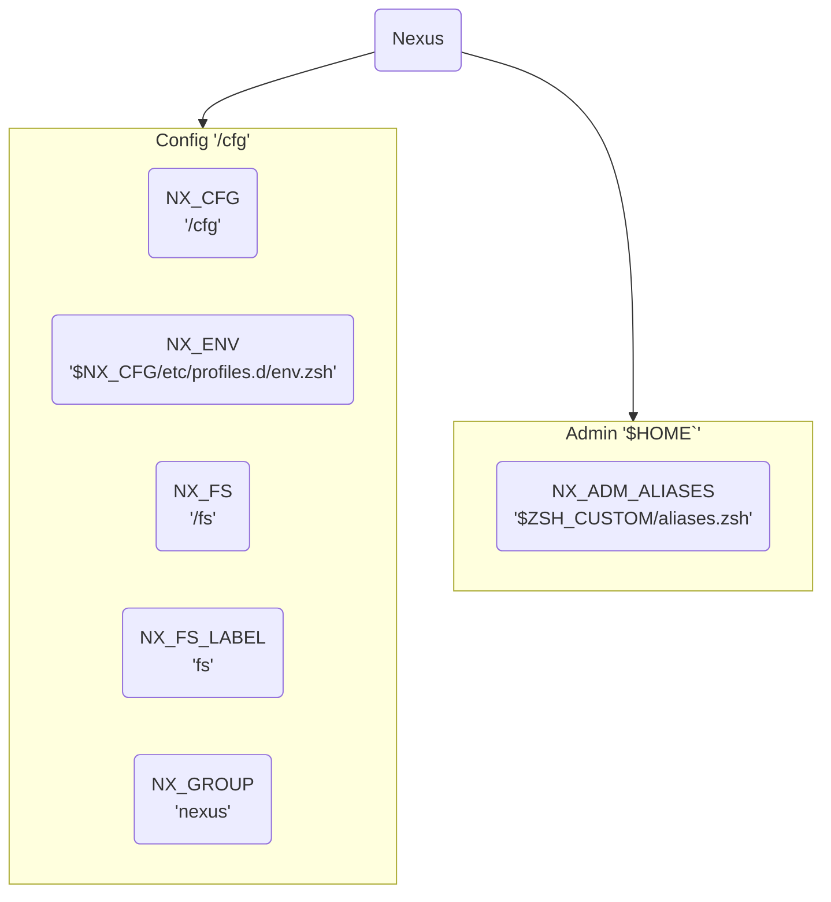

# Setup Guide (basic)

> [!Warning]
> **DO NOT USE YET!**  
> I'm creating and writing this guide in the open.
> - It's **not ready**.
> - Bugged instructions may **irreparably break** things.
>
> ***I frequently push broken states to main, because it's just text.***  
> *Proper scripts will follow, once this 101/PoC guide is done.*
>
> So test as you wish, but as a throwaway.
>
> Note that even the guide's numbering, sectioning, etc. is unstable.

Status: `v0.1` — **Work-in-progress!**  
Target: complete PoC (1); then proper writing (2).

- [ ] 0 — Variables
- [x] 1 — Install Linux (Kubuntu 24.04)
- [x] 2 — Terminal: Zsh, OMZ, bat, tldr, etc.
- [x] 3 — Security: browser, secrets, SSH server
- [ ] 4 — IOMMU
- [ ] . — Libvirt hooks (PCIe hand-off)
- [ ] . — VM (1) creation (VirtManager)
- [ ] . — Performance tweaks


---


> [!Tip]
> Footnote = **Help!**
> 🡪 *If some* `thing`[^footnote] *doesn't work, check out its footnote!*


## 📑 0 — Variables

List of all variables used in the GHost setup.  
*For `bash`, modify `*.zsh` paths.*[^bash-env]




```sh
# NX_        : NeXus global configuration variables
#   _NS      : NameSpace
#   _FS      : FileSystem
#   _CFG     : ConFiGuration
#   _ENV     : shell ENVironment
#   _GIT     : GIT (version control)
#       _DIR : DIRectory

NX_CFG="/cfg"
NX_NS="nexus"
NX_NS_FS="fs"
NX_NS_ENV="/etc/profile.d/nexus.sh"
NXNS_SSHD="/etc/ssh/sshd_config.d/nexus.conf"
NX_NS_UFW="/etc/ufw/applications.d/openssh-server"
NX_FS="/$NX_NS_FS"
NX_ENV="$NX_CFG$NX_NS_ENV"
NX_GIT_DIR="$NX_CFG/.git"


# NX_ADM_xxx = Nexus Admin variables

NX_ADM_ALIASES="$ZSH_CUSTOM/aliases.zsh"
```

To display all variables in use on a system, do any of:

```sh
set
compgen -v
```


## 🖥️ 1 — Host OS installation

*Two approaches for the host GUI: 'richer' (KDE, Gnome...) or 'leaner' (Mate, i3...).  
Here we go with KDE on Ubuntu, because it has many required features out of the box.*

> [!Note]
> This host OS, though perfectly usable as a workstation, will eventually operate as the lowest layer (the "hypervisor") in our single-PC virtualized infrastructure. It will sit 'underneath it all' from the standpoint of our ultimate virtual workstation. We give it GUI capabilities because it's cheap (integrated in most consumer CPUs), convenient for setup and use (as you're experiencing right now), and actually harder to avoid than not on consumer platform, whose default specs are optimized for workstation/desktop use as opposed to server (no dumb VGA or serial outputs, or adapters & devices to leverage those).  
> If you use a Epyc, Thunderbolt, or Xeon platform, YMMV; consider doing the hypervisor as a pure 'headless' server.


### 📀 Make a bootable device

1. Download the **Kubuntu [`.iso 🔽`](https://cdimage.ubuntu.com/kubuntu/releases/24.04/release/kubuntu-24.04-desktop-amd64.iso)** file.

1. Download the latest **Balena Etcher [release](https://github.com/balena-io/etcher/releases)** for your *current* OS (where you will flash the `.iso` to USB).

1. Install Etcher.

   ```bash
   sudo apt install ./balena-etcher_******_amd64.deb
   ```

1. Launch it (GUI 🖱️ app in your usual menu).

1. Flash `kubuntu-24.04-desktop-amd64.iso` onto your USB stick.

1. Shutdown the PC.


### 🐧 Install Linux

1. ⚠️ **Unplug (physically) all video outputs, except the host's.**

   *In this guide, the Ryzen iGPU is dedicated to the host.  
   So we unplug all video cables going out of the Nvidia GPU.*[^unplug]

1. Boot to USB to install Kubuntu.

1. **Follow the steps** (language, kbd. layout, time zone, network, `$HOST`, `$USERNAME`…)  
until it asks you about **storage**.

1. If you have multiple drives: 
   - pick a **SSD for the host OS**
   - but **leave the fastest drive for virtualization** (later).

1. Choose **Btrfs** for the OS root partition ("`/`").[^btrfs-root]
      
      ⛔ **WARNING: NEVER use RAID `5` or `6` with Btrfs!**  
      🡢 It's **fatally flawed**.  
      All manners of RAID `0` and `1` ( `1c3`, `1c4`, `10` ) are perfectly fine, however.
      
      We'll setup any other drives later.

1. Agree to install **`virt-manager`** to get the KVM/QEMU stack properly installed.
   
1. Remove the USB stick when asked to, then press <kbd>Enter</kbd>.

*You'll reboot on the freshly installed Ubuntu system, to be greeted by the KDE Welcome wizard.*


## ⚙️ 2 — Host OS configuration


### 🆙 First boot

1. Upgrade packages.

   ```bash
   sudo apt update
   sudo apt upgrade
   ```

1. Open KDE Settings.

1. Ensure **Display** is fine (Xorg|Wayland; resolution, refresh rate, scaling; **Fonts**, antialiasing…)  
   *Reboot if needed.*

1. Check the **Driver Manager** for your currently in-use GPU otherwise.
   
1. Do stuff needed for you (appearance, behaviors, shortcuts, Bluetooth, etc.)


### 🧑‍💻 Shell

1. Customize your terminal emulator preferences.

1. Install your preferred **CLI shell**.[^shell]

   *Suggestion:* [**Zsh**](https://github.com/agenkit/GHost/blob/main/doc/shell.md#zsh)  
   *It's easier for admin duties; allows advanced scripting (like Perl); transfers to BSD (including MacOS).*  
   *See* **[`Shell`](doc/shell.md)** *for more details.*

1. *(Optional) Play with OS & DE settings to your liking.  
Custom [DNS](https://www.quad9.net/); nice packages like `htop`, `batcat`, `tldr`; themes, etc.*

1. Add 


### 🗄️ Auxilliary Storage

**(Recommended for physical hardware)** 

Setup 'auxilliary' (i.e., non-OS) storage.

- **High IOPS** drives for virtualization (mounted at `/fs` ).
- Whatever additional space you require (optional, not covered specifically).


> [!Tip]
> For a given capacity, assuming cost is close enough and you have enough ports (NVMe/PCIe, SATA…), always prefer the highest number of smaller drives: for instance, 4× 1TB is better than a single 4TB drive. It opens parallelization and redundancy options (RAID) for you, improving performance and reliability.
>
>See 📜 **[Storage](doc/storage.md)** if needed beyond the example below, as it's hard to generalize for all cases.

Example setup:

   - number of drives: `n` = `3`
   - RAID level: `l` = `0`[^raid0]
   - XFS filesystem label: `-L` = `fs`
   - `mount` point: `/fs`

Change `n` and RAID level `l` to suit your needs.

> [!Important]
> Disk names below should be sourced from `/dev/disk/by-id/`  
🡢 Select names with a unique **serial_number** or `eui`

1. Install `mdadm` — **m**ultiple **d**evices **adm**inistration.

   ```sh
   sudo apt install mdadm
   ```

1. Create RAID level `0` virtual device `md0` with `3` disks.

   ```sh
   sudo mdadm -Cv /dev/md0 -l0 -n3 \
   /dev/disk/by-id/nvme-Samsung_SSD_XXX_PRO_1TB_<serial_number> \
   /dev/disk/by-id/nvme-Samsung_SSD_XXX_PRO_1TB_<serial_number> \
   /dev/disk/by-id/nvme-Samsung_SSD_XXX_PRO_1TB_<serial_number>
   ```

1. Check the array.

   ```sh
   cat /proc/mdstat
   sudo mdadm --detail /dev/md0
   ```

1. Format to XFS.

   ```sh
   sudo mkfs.xfs -L fs /dev/md0
   ```

1. Mount the RAID virtual device to a newly created (`-m` for mkdir) directory `/fs` .

   ```sh
   sudo mount -mo defaults,noatime,logbsize=256k /dev/md0 /fs
   ```

1. Then to setup boot mount, get the RAID virtual device UUID.

   ```sh
   sudo blkid | grep md0
   ```

   > 🡳 stdout
   >
   > ```
   > /dev/md0: LABEL="fs" UUID="xxxxxxxx-xxxx-xxxx-xxxx-xxxxxxxxxxxx" BLOCK_SIZE="512" TYPE="xfs"
   >                            🡡                                  🡡
   >                            This is your UUID number.
   > ```

1. Copy that UUID number.

1. Open `fstab`.

   ```
   sudo nano /etc/fstab
   ```
   
1. Add this line, presumably last.

   ```
   UUID=<your UUID number> /fs xfs defaults,noatime,logbsize=256k 0 0
   ```

1. **Reboot** to check that it works.  

> [!Info]
> After reboot, the `mdadm` RAID virtual device MAY be given a different name by **udev**.  
*In my case, it's `md127` instead of `md0`.*

From now on, we'll alias this filesystem mountpoint to `$NX_FS`: adjust the path for you if needed.

```sh
NX_FS='/fs'
NX_FS_LABEL='fs'
```


### 🎛️ Nexus control

1. Create a Nexus[^nexus] profile for environment variables.

   ```sh
   sudo nano /etc/profile.d/nexus.sh
   ```

1. Add these for starters.

   `/etc/profile.d/nexus.sh`  
   🡳

   ```sh
   # $NX_xxx = Nexus global configuration variables
   NX_NS="nexus"
   NX_FS="/fs"
   NX_FS_LABEL="fs"
   NX_CFG="/cfg"
   NX_ENV="$NX_CFG/etc/profile.d/nexus.sh"
   NX_ENV_LINK="/etc/profile.d/nexus.sh"
   NX_GIT_DIR="$NX_CFG/.git"
   
   # $NX_ADM_xxx = Nexus Admin variables
   NX_ADM_ALIASES="$ZSH_CUSTOM/aliases.zsh"
   
   # `export` all variables
   export NX_NS
   export NX_FS
   export NX_FS_LABEL
   export NX_CFG
   export NX_ENV
   export NX_ENV_LINK
   export NX_GIT_DIR
   export NX_ADM_ALIASES
   ```

1. Press <kbd>Ctrl</kbd> + <kbd>o</kbd>, then <kbd>Enter</kbd> to save the file.  
Then <kbd>Ctrl</kbd> + <kbd>x</kbd> to exit `nano` .

1. Source that profile file.

   ```sh
   source /etc/profile.d/nexus.sh
   ```

1. Create the Nexus Configuration directory structure.

   ```sh
   sudo mkdir -p \
   $NX_CFG/etc/profile.d \
   $NX_CFG/etc/ssh/sshd_config.d \
   $NX_CFG/etc/ufw/applications.d \
   $NX_CFG/home/$USER \
   $NX_CFG/usr/local/{bin,sbin} 
   ```

1. Copy our environment profile to the repo.

   ```sh
   sudo cp -v $NX_ENV_LINK $NX_ENV
   ```

1. Symlink it back to its correct location.

   ```sh
   sudo ln -s $NX_ENV $NX_ENV_LINK
   ```

1. Create the `nexus` Linux group, then the eponym user without login shell access.

   ```sh
   sudo groupadd -r $NX_NS && sudo useradd -r -s /bin/false -g $NX_NS $NX_NS
   ```

1. Change `/cfg` ownership to the `nexus` user and group.

   ```sh
   sudo chown -R $NX_NS:$NX_NS $NX_CFG
   ```

1. Create the command `nxctl-git`: a `git` wrapper to facilitate interaction with this repo.  
*A straightforward shell `alias`.*

   ```sh
   printf 'alias nxctl-git="sudo -u $NX_NS /usr/bin/git -C $NX_CFG"' | sudo tee -a $NX_ADM_ALIASES >/dev/null
   ```

1. Enable `nxctl-git`: either open a new terminal, or source the alias.

   ```sh
   source ~/.zshrc
   ```

1. Initialize a git repository.

   ```sh
   cd $NX_CFG \
   && nxctl-git init --initial-branch=main $NX_CFG
   ```

1. Configure `git` for use by the `nexus` user.

   ```sh
   nxctl-git config user.name ""
   nxctl-git config user.email ""
   ```

1. Create the `.gitignore` file.

   ```sh
   printf '
   # Nexus Configuration (Git)
   # Default location: /cfg/.gitignore
   '|sudo tee $NX_CFG/.gitignore >/dev/null
   ```

1. Create a README.

   ```sh
   printf '# Nexus Configuration' | sudo tee $NX_CFG/README.md
   ```

1. Add and commit all files we've managed so far.

   ```sh
   nxctl-git add . \
   && nxctl-git commit -m \
   "Add README.md, .gitignore, etc/profile.d/nexus.sh."
   ```

> [!Tip]
> It's good practice to reboot once in a while, to check that all configs survive.
>
> Consider making some `alias`-es to quickly check all relevant parts (e.g., `dmesg`, `mdadm`, `git`…).
>
> ```sh
> alias 'nxctl-status'='printf "[NCC-9] Nexus Configuration Check (9)\nStardate: 0%s" "$(date '\''+%y%V.%u%H'\'')"; sep&& cat /proc/mdstat; sep&& sudo mdadm --detail /dev/md0; sep&& nxctl-git status'


### 🌐 Browser

1. (Optional) *Install your browser of choice.*
    
    *I use [Brave](https://brave.com/linux/#debian-ubuntu-mint). Instructions as of Sept. 2024:*

   ```bash
   sudo apt install curl

   sudo curl -fsSLo /usr/share/keyrings/brave-browser-archive-keyring.gpg https://brave-browser-apt-release.s3.brave.com/brave-browser-archive-keyring.gpg

   echo "deb [signed-by=/usr/share/keyrings/brave-browser-archive-keyring.gpg] https://brave-browser-apt-release.s3.brave.com/ stable main"|sudo tee /etc/apt/sources.list.d/brave-browser-release.list

   sudo apt update
   sudo apt install brave-browser
   ```


## 🔒 3 — Security


### 🗝️ Secrets

1. Setup whatever means you use to **store and access secrets**.  
   *Password manager, pen and paper, `pass`, savant memory… it's up to you.*[^secrets]

1. Fill in all **credentials for this workstation**. User password, any filesystem encryption passphrase, browser sync, etc.


### 🧱 Firewall

**`ufw`**, the **U**ncomplicated **F**ire**w**all,[^ufw] is preinstalled with Ubuntu.

GUI setup:

1. Open the Settings > **Firewall** app  

1. Tick the top box to **enable** it.

1. Check that "Default **Incoming** Policy" is set to **`Ignore`**.

1. Check that "Default **Outgoing** Policy" is set to **`Allow`**.

[CLI setup](https://documentation.ubuntu.com/server/how-to/security/firewalls/):

```bash
sudo ufw enable
sudo ufw status verbose
```


### 🔐 SSH server

1. Install OpenSSH, both `client` and `server`.

   ```sh
   sudo apt install openssh-client openssh-server
   ```

1. Create and edit a new config file.

   ```sh
   sudo nano /etc/ssh/sshd_config.d/nexus.conf 
   ```

1. We'll only take care of a few security aspects for now.

   ```
   
   # This is the sshd server nexus-wide configuration file.  See
   # /fs/nexus.md for more information.
   
   # The strategy used for options is to override the defaults at
   # /etc/ssh/sshd_config with the following.
   
   Port 60000
   AddressFamily inet
   ListenAddress 127.0.0.1
   
   HostKey /etc/ssh/ssh_host_ed25519_key
   
   AllowUsers kit
   PermitRootLogin no
   
   PasswordAuthentication no
   ```
   
   *You may need to reboot for OpenSSH to work properly and accept your settings. We don't need it yet though, so it can wait.*

1. Enable `ssh` in systemd.

   ```sh
   sudo systemctl enable ssh
   ```

> [!Note]
> At this point, the ssh server isn't accessible from the outside world, on purpose.
> We'll set it up properly later, along with `ufw`.


## ❇️ 4 — IOMMU

> [!Important]
> For the next few sections, we mostly rely on **Bryan Steiner's excellent [tutorial](https://github.com/bryansteiner/gpu-passthrough-tutorial/)**.  
**Check it first** if my simplified copycat doesn't get you through!

1. Reboot to UEFI settings.[^uefi]

1. Enable a feature called `IOMMU`.

1. Enable CPU virtualization features: **`AMD-Vi`**, or **`VT-d`** (for Intel). 
   
1. Save any changes and reboot to Linux.

1. Make sure that IOMMU and CPU virtualization features are enabled. 

   *Note: for Intel, replace* `AMD-Vi` *by* `VT-d` .

   ```sh
   sudo dmesg | grep 'IOMMU\|AMD-Vi'
   ```

   > 🡳 stdout
   > ```
   > [    0.047873] AMD-Vi: Unknown option - 'on'
   > [    0.126298] AMD-Vi: Using global IVHD EFR:0x246577efa2254afa, EFR2:0x0
   > [    0.424759] pci 0000:00:00.2: AMD-Vi: IOMMU performance counters supported
   > [    0.428506] AMD-Vi: Extended features (0x246577efa2254afa, 0x0): PPR NX GT [5] IA GA PC GA_vAPIC
   > [    0.428514] AMD-Vi: Interrupt remapping enabled
   > [    0.479919] AMD-Vi: Virtual APIC enabled
   > [    0.481433] perf/amd_iommu: Detected AMD IOMMU #0 (2 banks, 4 counters/bank).
   > ```

1. Open the [GRUB2](https://help.ubuntu.com/community/Grub2) config file.

   ```sh
   sudo nano /etc/default/grub
   ```

1. Edit `GRUB_CMDLINE_LINUX_DEFAULT`.

   ```
   GRUB_CMDLINE_LINUX_DEFAULT="quiet splash amd_iommu=on"
   ```

1. To determine your IOMMU grouping, create `iommu.sh` .


   

   ```
   #!/bin/bash
   for d in /sys/kernel/iommu_groups/*/devices/*; do
     n=${d#*/iommu_groups/*}; n=${n%%/*}
     printf 'IOMMU Group %s ' "$n"
     lspci -nns "${d##*/}"
   done
   ```


## 🪝 Libvirt hooks

## 🌱 VM (1) creation

## 🔥 Performance tweaks


----

[^footnote]: Click the ending link to go back up where you were:

[^bash-env]: For `bash`, use these:  
  ```
  NX_ADM_ALIASES="$HOME/bash_aliases.sh"
  NX_ADM_ENV="$HOME/nexus_env.sh"
  ```


[^unplug]: Generally, unplug all non-host devices during host OS installation. This ensures that, later on:  
      - proper graphics drivers will get installed on the host (*AMD in this guide*);  
      - auto-configs (Xorg…) work well;  
      - guest GPU is available for passthrough. *In this guide, it's the Nvidia dGPU.*  

[^btrfs-root]: Gives us neat features like easy system rollback/versioning, remote backup, later conversion of a single device to RAID 1, and more. Facilitated by tools like `btrbk` or Timeshift.

[^secrets]: This guide doesn't have general opinions about which solution best fits **you**, as security depends on threat profile; but most people should use **something** fitting their personal needs. Here are a few suggestions I'm using concurrently for different purposes.
      - [Proton Pass](https://proton.me/pass) as part of a [secure suite of services](https://proton.me/) including email with domain, VPN, cloud storage, doc writing, password management; and combined features such as uniquely generated email addresses per account. *Note that Proton services lack many Linux clients (Drive, Pass…), forcing you to the web interface. They notably has little to no CLI tools. That's too bad, but it's not like there are many alternatives at that level of security and privacy.*
      - [1Password](https://1password.com/) for a standalone, comprehensive secrets solution. It has extensive comfort features to store all manners of secrets, including ssh keys, payment credentials, social security and ID scans, etc.  
      - [`pass`](https://www.passwordstore.org/) (CLI tool), and [compatible](https://www.passwordstore.org/#other) apps.  
      
      Both Proton and 1Password are good for org and family admins: pass sharing, account management & retrieval…  
      You know who you are if you want/need `pass` (I consider it a better but harder solution for most purposes).

[^ufw]: 📘`man`: [`ufw(8)`][man-ufw]

[^shell]: Ricing: I use [Zsh](https://zsh.org/),  
with [Oh My Zsh](https://ohmyz.sh/) (OMZ),  
the [Spaceship Prompt](https://spaceship-prompt.sh/) theme,  
and a [NerdFont](https://github.com/ryanoasis/nerd-fonts) (preview them [here](https://www.nerdfonts.com/font-downloads)).

[^uefi]: Usually, spam <kbd>Del</kbd> or <kbd>F2</kbd> during POST (when the PC displays some first page with CPU, RAM, storage info; which might be hidden by a fullscreen logo: spam anyway).  
  On KDE, you can open **System Settings** > **Startup and Shutdown** > **Desktop Session** (or just search for '`UEFI`' your app launcher), and in the **Firmware** section (last), tick "**After next restart: [ ] Enter UEFI setup screen**".

[^nexus]: The GHost PC setup (this guide) is part of a larger systems paradigm called '**Nexus**'.  
(may be shortened to `nex`, `nxs`, `nx`…)


[^SHost]: `SHost` (Server Host) is the **CLI/headless** variant.  
     - It's closer to a Type-I hypervisor.  
     - Both `GHost` & `SHost` allow for 'native' graphical guests with plugged-in display, keyboard, mouse…  
     - Both are part of my tentative [***Ultra***structure]() computing paradigm.  

[^?]: Consider using PCIe splitters if you don't have enough slots. Keep in mind that expensive PLX chips won't help for concurrent use, so I'd avoid them for GHost.


[^raid0]: Using **RAID 0 is highly discouraged** unless you do regular backups (or don't care about that data). That said, modern NVMe drives usually fail to read-only mode, letting you retrieve the data, whose loss is thus highly unlikely.  
  Do as you wish, but good backups of a RAID 0 NVMe should be safe enough for personal use, if you can live with some down time once a decade if/when it fails (it never did for me, as drives get replaced well before EoL).

[^xfs]: 


[man-ufw]: https://manpages.ubuntu.com/manpages/noble/en/man8/ufw.8.html
